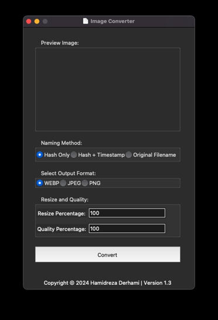

# Converterz - Image Conversion Utility

**Version:** 1.3  
**Author:** Hamidreza Derhami  
**Website:** [https://hawid.ir/](https://hawid.ir/)

## Overview
Converterz is a lightweight and fast image conversion utility written in Python. It allows users to easily convert images to different formats, resize them, and customize the output naming conventions.

## Features
- **Hash-based Naming:** Utilizes MD5 hashing for secure and unique filenames.
- **Automatic Folder Creation:** Creates a 'Converterz' folder on the Desktop to store converted images.
- **Output Format Selection:** Supports webp, jpeg, and png formats.
- **Resize Percentage:** Allows users to resize images based on a specified percentage.
- **Quality Adjustment:** Customizable image quality in percentage.
- **Conversion Preview:** Provides a preview of the selected image before conversion.
- **Progress Bar:** Displays the progress of image conversion.
- **Logging:** Logs conversion activities and errors for future reference.
- **Drag-and-Drop Support:** Users can drag and drop images for conversion.
- **Cross-Platform:** Developed for macOS, featuring a macOS-inspired design.

## Usage
1. Open the Converterz application.
2. Choose an image using the file dialog or drag-and-drop an image onto the window.
3. Configure conversion options, including naming method, output format, resize percentage, and quality.
4. Click the "Convert" button to initiate the conversion process.
5. Monitor the progress bar and receive notifications on completion.

## License
This project is licensed under the MIT License - see the [LICENSE.md](LICENSE.md) file for details.

## Acknowledgments
- Special thanks to the author, Hamidreza Derhami, for creating this efficient image conversion tool.

If you encounter any issues or have suggestions for improvement, please feel free to open an issue on this GitHub repository.
